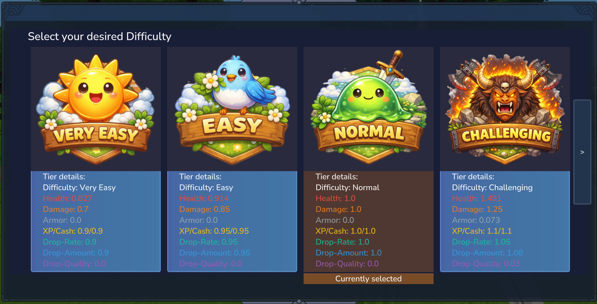
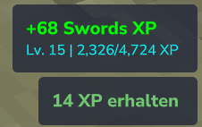
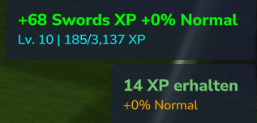

<!-- markdownlint-disable MD033 MD041 -->

# Ascendant Difficulty

Mod for the Hytale Server that manages per-player difficulty tiers and dynamically scales enemies and rewards.

 

---

## Table of contents

- [Features](#features)
- [Configuration](#configuration)
- [Dependencies](#dependencies)
- [Command and Permission](#command-and-permission)
- [Integrations (Optional)](#integrations-optional)
- [Not a public end-user release](#not-a-public-end-user-release)

---

## Features

- Per-player difficulty tiers with a configurable list (defaults include Ascendant I-XX).
- Tier selection UI (`/ascendant-difficulty`) with paging; respects `is_hidden` and `is_allowed`.
- HUD badge for the current tier with a per-player toggle (`/ascendant-difficulty-badge-toggle`) when `base.allowUIBadge` is enabled.
- Enemy HP scales to the nearest player in range.
- Incoming damage to players scales by tier; enemy armor reduces player damage dealt.
- Loot scaling: drop rate, drop quantity, and drop quality per tier.
- XP and cash multipliers per tier (with cash variance) when integrations are present.
- Per-player tier overrides and badge visibility are persisted.

(<a href="#top">back to top</a>)

---

## Configuration

The default config is written to `config/ascendant/difficulty.json`.

Key sections:

- `base`: global switches/limits: `defaultDifficulty`, `allowDifficultyChange`, `allowUIBadge`, `allowHealthModifier`, `allowDamageModifier`, `allowArmorModifier`, `allowDropModifier`, `allowXPReward`, `allowCashReward`, `allowCashRewardEvenWithPhysical`, `cashVarianceFactor`, `playerDistanceRadiusToCheck`, `minDamageFactor`, `minHealthScalingFactor`, `maxHealthScalingFactor`, `healthScalingTolerance`, `allowDebugLogging`.
- `tiers`: per-tier flags and multipliers: `is_allowed`, `is_hidden`, `health_multiplier`, `damage_multiplier`, `armor_multiplier`, `drop_rate_multiplier`, `drop_quantity_multiplier`, `drop_quality_multiplier`, `xp_multiplier`, `cash_multiplier`.
- `meta`: UI metadata per tier: `displayName`, `description`, `imagePath`, `iconPath`.

Player settings are stored in `config/ascendant/players-settings.json` (keys: `difficulty`, `showBadge`).
Legacy overrides from `config/ascendant/difficulty-players.json` are migrated if found.

(<a href="#top">back to top</a>)

---

## Dependencies

- Required: `Ellie:HyUI` (tier selection page + HUD badge).

(<a href="#top">back to top</a>)

---

## Command and Permission

- Command: `/ascendant-difficulty` (open tier selection UI)
- Command: `/ascendant-difficulty-badge-toggle` (toggle badge visibility)
- Permission: `ascendant.difficulty` (required for both commands)

(<a href="#top">back to top</a>)

---

## Integrations (Optional)

- LevelingCore: applies bonus XP based on `xp_multiplier` and updates XP notifications; also triggers cash bonuses via Ecotale.
- MMOSkillTree: applies bonus XP and appends a percentage line to green `+XP` notifications.
- Ecotale: deposits bonus cash based on `cash_multiplier` (respects `allowCashReward` and `allowCashRewardEvenWithPhysical`).

If these APIs are missing, XP/cash multipliers are skipped; core difficulty scaling (health/damage/armor/loot) still runs.

#### Notification examples:

(<a href="#top">back to top</a>)

---

## Not a public end-user release
> [!IMPORTANT]
> This repository is not intended to be published as a finished, end-user mod
> (e.g. on CurseForge or similar platforms).
>
> The code may be freely viewed, copied, modified, reused, and incorporated
> into other projects without restriction.
>
> The only intended limitation is scope: this project exists primarily for
> private use and experimentation, rather than as a polished, public-facing release.

 
(<a href="#top">back to top</a>)

